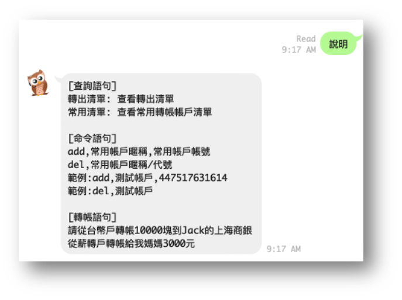

# Chatbot-Transfer

* Completed the **transfer money** function combined with Line messaging API
* Inplemented both NLP NER and classification tasks, and even understood user semantics using BERT pre-train model, CKIP tagger from SINICA and similarity algorithm designed by my colleage
* Precisely extracted "subject", "verb" and "object" from a spoken sentence when trainsferring money

## Demo
- Instruction on beginning

  

